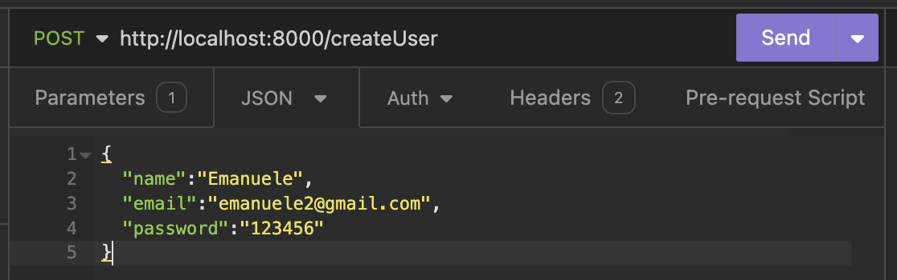
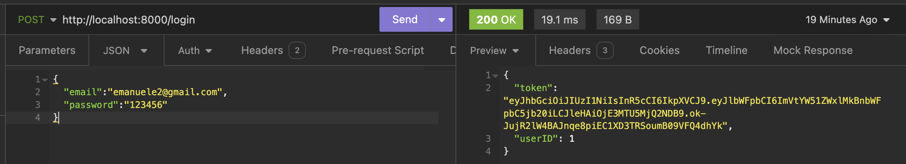
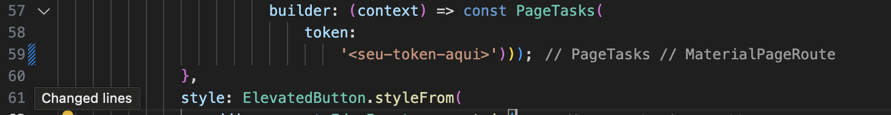
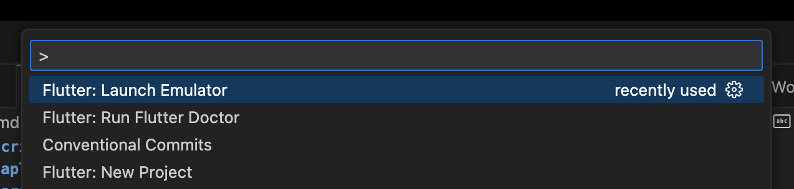

# Aplicativo de criação de tarefas em flutter - Ponderada 2

> Aviso 1: Para execução dessa atividade será necessário acessar o backend em outro diretório desse mesmo repositório.

> Aviso 2: A API que foi integrada esta funcionando por meio de autenticação, todavia, nessa entrega (14/05/24) fluxo do App ainda não foi incorporado o login. Por esse motivo o token de acesso as rotas está sendo passado hardcoded. 

> Aviso 3: Essa entrega (14/05/24) incorpora a integração de **todas** as rotas CRUD.

## Como rodar a aplicação

### Instruções para lançar o backend integrado ao APP

> Dentro do diretório `ponderada-m10/back-golang` é possível encontrar o código fonte do backend integrado e mais instruções sobre o memso.


1. Será necessário lançar o backend para o funcionamento dessa atividade. Dentro do diretório `ponderada-m10/back-golang` crie um arquivo `.env` com as sequintes informações:

```
POSTGRES_DB= <seu-banco-de-dados>
POSTGRES_USER= <seu-user>
POSTGRES_PASSWORD= <sua-senha>
```
2. No mesmo diretório rode o comando abaixo:

```
docker compose --env-file ./.env up
```

Após o inicio da execução do backend é necessário criar o primeiro usuário no banco de dados lançado para obter o token que irá permissionar a interação com as rotas. Para isso acesse a collections do Insomnia disponível em `ponderada-m10/back-golang/static/insomnia_go.json` e interaja a rota de `Create User` e de `Login`. 

- Create User


- Login


> IMPORTANTE:
Ao acessar a rota de login ela retornará um token que será necessário atualizar no codigo fonte do app (14/05/24). Para isso copie o token de resposta e cole no aquivo `ponderada-m10/app_flutter/lib/pages/login.dart` e mude a linha 59 colocando o token de resposta.



### Instruções para lançar o aplicativo flutter

> É super importante que os passos anteriores sejam seguidos antes de lançar o app flutter. Além disso estou partindo do pressuposto que o flutter já está devidamente configurado na máquina.

1. Abra o VS Code e aperte Crtl + Shift + P  . Isso ira abrir um menu. Clique na opção `Flutter: Launch Emulator`.



Após isso selecione o dispositivo virtual que você deseja rodar a aplicação.

2. No terminal dentro do `ponderada-m10/app_flutter` rode em sequencia os comandos abaixo:

```
flutter pub get
flutter run
```

## Video do funcionamento

https://drive.google.com/file/d/1ggub6Csyowfvj6-6b86jxWVaGh9qQSHu/view
