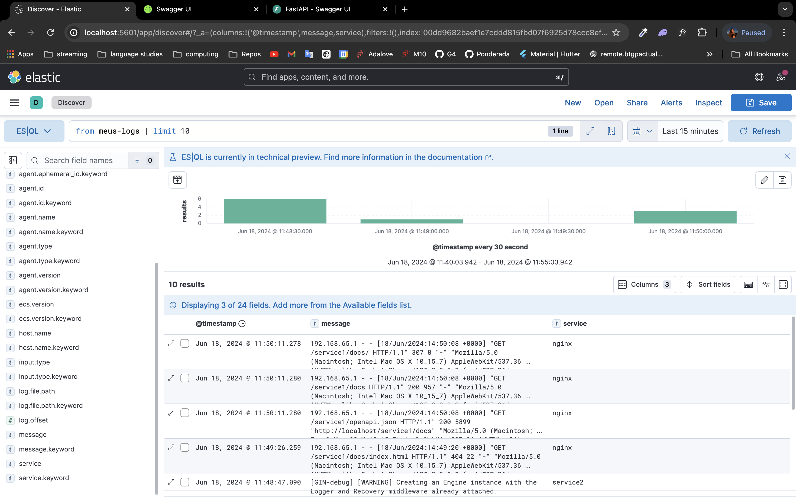

# Ponderada 4: Implementando Logs

## Explicação do quee foi feito:

Existem dois microserviços de API, um feito em Python, disponível em `ponderadas-10/ponderada4/service1-python`, e outro feito em Go, disponível em `ponderadas-10/ponderada4/service2-golang`. Ambas as APIs são acessadas através do Nginx, que atua como um gateway para o sistema. Foi implementado um sistema de logs baseado em Filebeat e Elasticsearch, onde todas as chamadas feitas através do Nginx para acessar as APIs são registradas. O Filebeat é responsável por coletar as informações dos logs e enviá-las para o Elasticsearch, que as armazena e indexa no formato chave-valor. Além disso, foi implementado o Kibana para a visualização dos logs.

## Como executar o código:

1. Clone esse repositório;
2. Acesse a pasta `ponderadas-10/ponderada4`;
3. Rode o comando abaixo:
```
docker compose up
```

## Como testar o funcionamento

Para acessar o swagger dos serviços, coloque no navegador;

1. Serviço 1 (Python/Fast API): http://localhost/service1/docs
2. Serviço 2 (Golang): http://localhost/service2/docs/index.html#
3. Kibana (Visualizador de logs do elastic): http://localhost:5601/app/home#/

- Print dos logs



## Video

https://drive.google.com/file/d/1ldh0FEkjkRNBjUpjQGIXc9W8x26sNvlF/view?usp=sharing